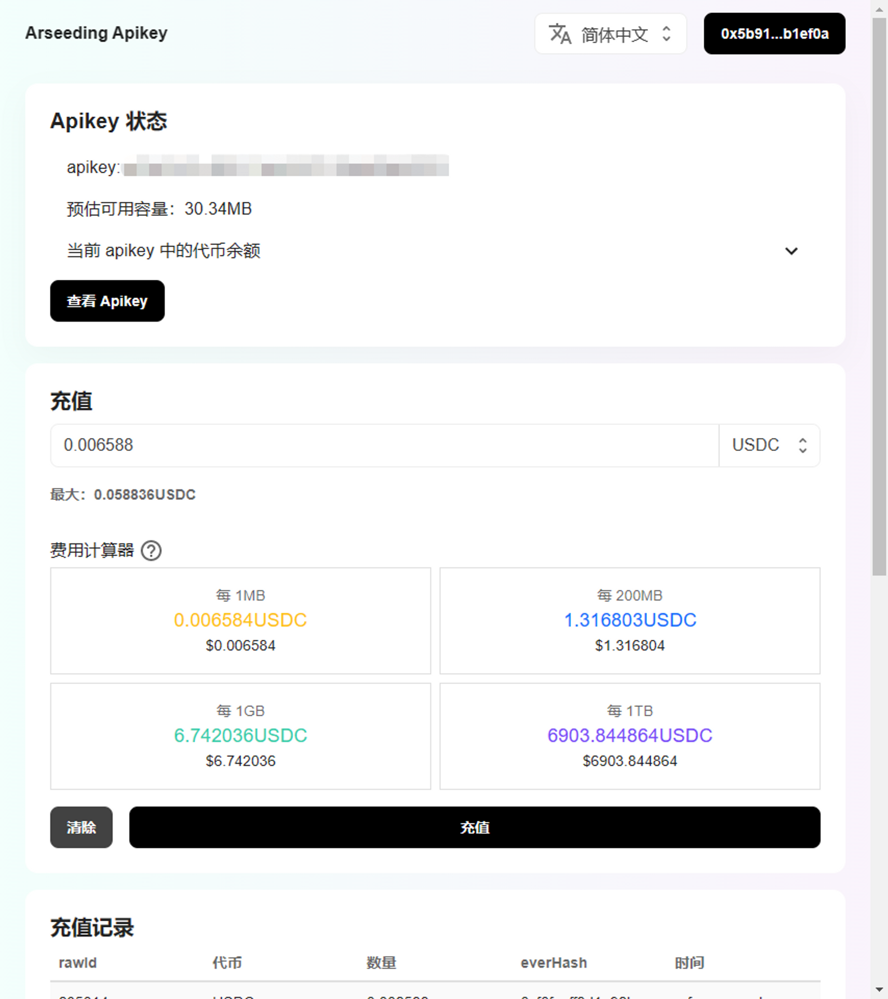

# 申请 apiKey

## 什么是 Arseeding

Arseeding 支持 Bundle（ANS-104）类型的交易。与 Arweave 原生交易相比，Bundle 交易更适合大量小文件存储的场景。在使用 Bundle 交易存储数据时，Arseeding 支持使用 everPay 进行存储费用支付，这意味着你不必持有 AR 代币也能使用 Arweave 的文件存储服务。同时，Arseeding 可以 100% 保证将文件上传到 Arweave 节点，提高开发人员的存储体验。

## 为什么我们需要 Apikey

因为使用 Arseeding 需要钱包，对非 web3 的用户或开发者不友好，所以我们开发了预付费功能（类似卡密）来支持传统开发者使用 Arweave。预付费功能主要由支持 apikey 体现。Arseeding apikey 需要预先充值一定数量的代币，在未来使用 Arseeding 上传数据到 Arweave 网络时可以通过传入  apikey 抵扣存储费用，而不必使用 web3 钱包！

本教程将介绍如何使用 apikey 为 Arseeding 上传数据到 Arweave 付费。


### 获取 Apikey

Arseeding Apikey 与钱包地址绑定。访问 [Apikey 前端](https://apikey.web3infra.dev/) 使用  EVM 兼容的钱包登录网页，使用 everpay 支持的代币充值可以得到一个预付费的 apikey（首次充值会为新钱包自动生成一个 apikey），稍后我们可以使用这个 apikey 调用 Arseeding 相关接口将数据永久保存到 Arweave 网络！



Apikey 像密码一样重要！拥有 apikey 的人可以任意使用 apikey 中的余额，因此 apikey 不能随意泄露。

### 使用 Apikey 抵扣存储费用

下面以 [arseedingjs sdk](../sdk/arseeding-js/bundle.md) 为例子展示如何使用 apikey 将数据存储到 Arweave。

```ts

const arseedingUrl = "https://arseed.web3infra.dev";
const apikey = process.env.APIKEY;
const data = "some data here....";
const contentType = "text/html; charset=utf-8";
const tags = { a: "aa", b: "bb" };

const res = await submitByApikey(
  arseedingUrl,
  apikey!,
  "USDC",
  Buffer.from(data),
  contentType,
  tags
);

console.log({ res });
// {
//  res: { itemId: '8pW7W74H8qLqj4p2ZX4vIkfO08K31j4CAXVVLS2pjMw', size: 18 }
// }

```

上面的 **submitByApikey** 方法将我们的数据上传到 Arseeding，并由 Arseeding 签名后存储到 Arweave 中。有时我们希望使用自己的钱包签名上传的数据以确权，这时候我们可以使用 **createAndSubmitItem** 方法：

```ts

const arseedingUrl = "https://arseed.web3infra.dev";
const apikey = process.env.APIKEY;
const secret = process.env.SECRET;

const data = "some data here....";
const tags = [
  {
    name: "a",
    value: "aaaa",
  },
  {
    name: "b",
    value: "bbb",
  },
  {
    name: "Content-Type",
    value: "text/html; charset=utf-8",
  },
];

const wallet = Wallet.fromMnemonic(secret!);

const eccSigner = new ArseedingArBundles.signers.EthereumSigner(
  wallet.privateKey.substring(2)
);

const res = await Arseeding.createAndSubmitItem(
  Buffer.from(data),
  { tags },
  {
    apiKey: apikey,
    currency: "USDC",
    arseedUrl: arseedingUrl,
    signer: eccSigner,
    path: "",
  }
);

console.log({ res });
// {
//   res: {
//     itemId: "TTQ-UsWo6Tj8e6m-WldrSmBmnirs9RmIs0jFMDW50Yw",
//     size: 221,
//     bundler: "uDA8ZblC-lyEFfsYXKewpwaX-kkNDDw8az3IW9bDL68",
//     currency: "USDC",
//     decimals: 6,
//     fee: "1805",
//     paymentExpiredTime: 0,
//     expectedBlock: 1159234,
//   },
// };

```

[点击跳转该仓库查查看完整示例代码。](https://github.com/ethever/arseeding-apikey-demo)